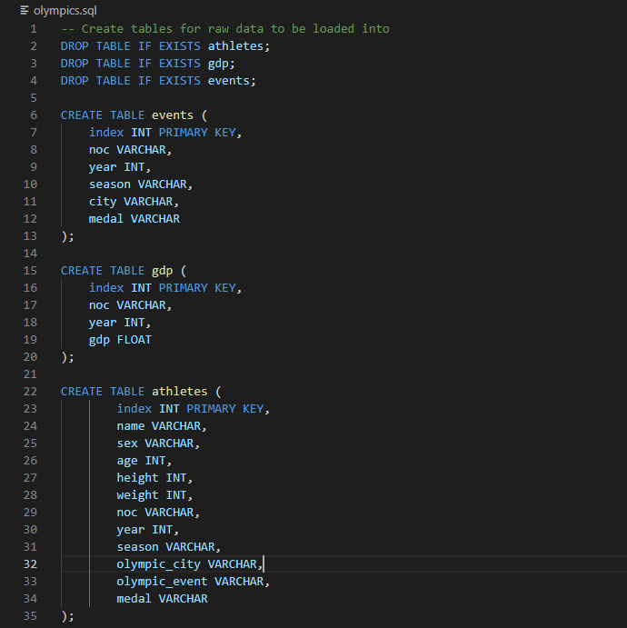

# ETL Project: Olympics & GDP Data

2021-08-11

## Objective
* Create `olympics_db` database in pgAdmin 4 with following tables within:
  * `events` table that contains the columns `noc`, `year`, `season`, `city` and `medal`.
  * `athletes` table that contains the columns `name`, `sex`, `age`, `height`, `weight`,`noc`, `season`, `year`, `olympic_city`, and `medal`.
  * `gdp` table that contains the columns `noc`, `year` and `gdp`.
 
### Extraction
  * Put each [**CSVs from Kaggle**](Resources) into a pandas DataFrame.

### Transform
  * Copy only the columns needed into a new DataFrame.
  * Rename columns to fit the tables created in the database.
  * Set index to the previously created primary key.

### Load
  * Create a connection to `olympics_db` database.
  * Check for a successful connection to the database and confirm that the tables have been created.
  * Confirm successful **Load** by querying database.

